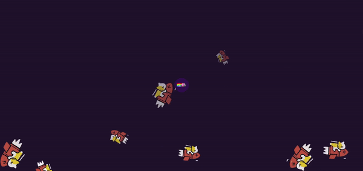

[Return to README.md](https://github.com/nguyenthiyenchi/front-end-projects/blob/main/README.md)

## Background
1. **Project Demo:**

2. **Description:** 
    - Developed a background featuring a dynamic design with 10 cat GIFs that drift upwards and spin at varying time delays and durations.
    - A central button triggers the appearance of an input bar when clicked, adding an interactive element to the design.
    
3. **Purpose:** 
    - To create an engaging and visually dynamic background design.
    - To incorporate interactive elements that enhance user engagement by providing a responsive interface.