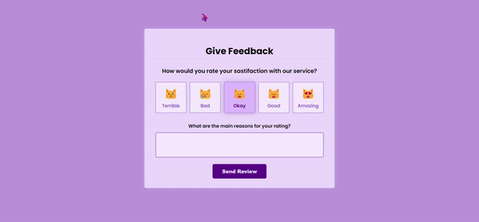

[Return to README.md](https://github.com/nguyenthiyenchi/front-end-projects/blob/main/README.md)

## Feedback Cat
1. **Project Demo:**

2. **Description:** 
    - Developed the "Feedback Cat" project, which includes a feedback container with five different options to rate satisfaction: Terrible, Bad, Ok, Good, and Amazing, each represented by a corresponding cat emotion. 
    - Users can optionally provide additional feedback in a textarea. 
    - Upon submission, users receive a tailored response: a promise to fix issues for "Terrible" and "Bad" ratings, and a thank-you note with a commitment to improve for "Ok," "Good," and "Amazing" ratings.
    
3. **Purpose:** 
    - To create an engaging and user-friendly feedback system that allows users to express their satisfaction level with ease and provides personalized responses based on their input.
    - To encourage user interaction and improve service quality by acknowledging and addressing feedback in a thoughtful manner.