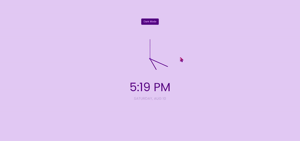

[Return to README.md](https://github.com/nguyenthiyenchi/front-end-projects/blob/main/README.md)

## Theme Clock
1. **Project Demo:**

2. **Description:** 
    - Developed the "Theme Clock" project, which features a unique clock in the center of the screen with three hands for hours, minutes, and seconds, similar to a wall clock. 
    - Below the clock, the current time is displayed in a digital format, and another line shows the current day and month. 
    - Additionally, a button above the clock allows users to switch between dark and light themes.
    
3. **Purpose:** 
    - To provide a visually distinct and interactive clock interface that combines analog and digital elements.
    - To enhance user experience by offering customizable themes, allowing users to switch between dark and light modes based on their preference.