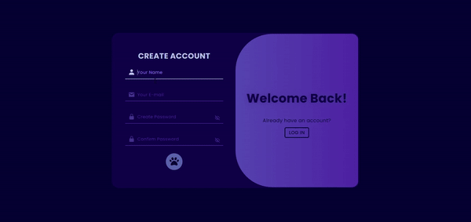

[Return to README.md](https://github.com/nguyenthiyenchi/front-end-projects/blob/main/README.md)

## Login/Signup
1. **Project Demo:**

2. **Description:** 
    - The "Login/Signup" project features a dynamic interface where users can switch between creating an account and logging in. 
    - Initially, the left side contains a form for account creation, while the right side welcomes returning users. 
    - When the "SIGN IN" button is clicked, the right section smoothly swaps with the left, transforming the left side to display a "Hello, Friends" message with an option to return to the "CREATE ACCOUNT" section. 
    - This interactive design enhances user experience by providing a fluid and engaging transition between the login and signup processes.
    
3. **Purpose:** 
    - To offer a visually appealing and user-friendly interface for both account creation and login.
    - To enhance user engagement through smooth transitions and intuitive design, making it easy for users to navigate between signing up and logging in.